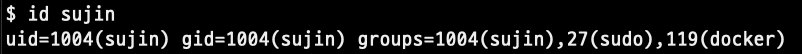
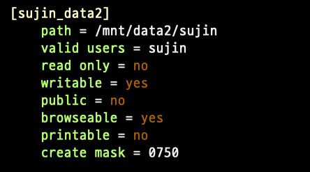

<br/>
<details markdown="block">
  <summary>
    Table of contents
  </summary>
  {: .text-gamma }
- TOC
{:toc}
</details>
<br/>

## 배경

딥러닝 모델 학습을 하고 있는 서버에서의 GPU는 모두 사용 중이고,  
중간에 저장된 모델을 평가해보고 싶은데 CPU로 돌리자니 이건 아닌데 싶어서.  

서버 디렉토리를 데스크탑에 연결하는 것처럼 리눅스 서버끼리도 되지 않을까?  
폴더는 원격으로 붙여서 기존 서버의 저장공간을 쓰고 GPU는 새로운 서버 걸 쓸 수 있으면?  

## 서버 연결

1. 참조되는 서버에 samba 설치 및 **[유저 추가](1-add-user-linux-server-and-setting-samba.md)**

2. 클라이언트에 samba, cifs-utils, smbclient 설치

```
sudo apt-get install -y samba cifs-utils smbclient
```

3. 두 서버 모두에서 `samba service` 실행되는지 확인

```bash
sudo service smbd status
```

- (+) 서버에서 방화벽 해제

```bash
sudo ufw allow 137,138/udp
sudo ufw allow 138,445/tcp
```

4. 클라이언트에 마운트할 폴더 만들기
    - 여기 아래 예에서는 `eos_m3_small/`

6. 클라이언트에서 서버 디렉토리 마운트
```
sudo mount -t cifs //100.10.54.161/sujin ./eos_m3_small/ -o username=sujin,uid=1007,gid=1007
```
- uid, gid는 클라이언트에서 확인
    - ‘ id sujin ‘ → 마운트한 폴더의 소유권자로 설정됨 `user id: group id`
    -   

    - ip 주소는 //로 시작하고 디렉토리 주소는 /home/sujin이면 /sujin으로 작성
    - 이 때 /sujin의 `sujin`은 다음 이미지의 `sujin_data2`와 같음

| `/etc/samba/smb.conf 설정 내용 중 일부`  |
|:----------------------------------------:|
|  |

7. (다른 예시) `/mnt/data1/sujin`을 마운트
    1. server: sif / client: thor  
    2. 이 때 samba 서버의 samba home이 ‘/mnt/data2/sujin’  

```
sudo mount -t cifs //100.10.54.90/sujin/m3/data sif_data/ -o username=sujin,uid=1000,gid=1000
```
- username = (파일이 진짜 위치하는) 서버에 접속할 아이디 (samba의 아이디)  
- uid, gid = (파일을 받아올) 클라이언트에서 접근할 권한 (클라이언트에 있는 아이디의 정보)  
- (+) passwd = 서버 samba의 비밀번호   
- 마운트를 하면 클라이언트 서버의 디렉토리를 다른 서버의 디렉토리의 바로가기처럼 만드는 것  
- 그래서 <mark style='background: #fff5b1;'>가상환경은 각 서버마다 세팅을 해줘야 함</mark>

---

## 서버 연결 해제

1. 언마운트
```
sudo umount /mount PATH/
```

## (+) samba config (smb.conf)
```
[sujin]
    path = /home/sujin
    valid users = sujin
    read only = no
    writable = yes
    public = no
    browseable = yes
    printable = no
    create mask = 0750
```
- [sujin] : 공유 폴더 이름
- path: 공유 폴더 실제 경로
- valid users: 접근 가능한 사용자 지정, 지정하지 않으면 전체 사용자 접근 가능
- read only: 읽기만 가능하도록 설정할 지 여부
- writable: 쓰기 여부
- public: 개인만 사용하도록 설정할지 공동 사용할지 설정
- browseable: 이용 가능한 공유 리스트에 표시될 지 여부
- printable: 프린터 사용 여부
- create mask: 생성 권한