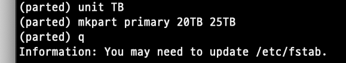

<br/>
<details markdown="block">
  <summary>
    Table of contents
  </summary>
  {: .text-gamma }
- TOC
{:toc}
</details>
<br/>

서버 설정을 수정하는 것이므로 관리자 권한이 필요하다.  
따라서 해당 문서의 모든 명령어는 sudo 권한으로 수행되어야 한다.  

## 01. 디스크 상태 및 사이즈 확인

다음 명령어를 통해 연결되어있는 디스크 상태 및 사이즈를 확인한다.

```bash
sudo fdisk -l
```

### 1 ) 설정 안 된 디스크 찾는 법

1. `df -h` 명령어로 현재 디스크들의 상태를 확인한다.
2. `fdisk -l`의 출력 결과에서 할당이 안 된 디스크의 이름을 확인한다.

| 파티션이 설정된 디스크         | 파티션이 설정되지 않은 디스크     |
| ------------------------------ | --------------------------------- |
|  |  |
 
#### (+) 디스크 네이밍 방법

출처: [https://www.debian.org/releases/stable/armhf/apcs04.ko.html](https://www.debian.org/releases/stable/armhf/apcs04.ko.html)

- 하드디스크(HDD, Hard Disk Drive)
    - 첫 번째로 발견된 하드디스크 이름 = `/dev/sda`
    - 두 번째로 발견된 하드디스크 이름 = `/dev/sdb`
- 플로피 디스크 드라이브(Floppy Disk Drive)
    - 첫번째 플로피 디스크 드라이브 이름 = `/dev/fd0`
    - 두번째 플로피 디스크 드라이브 이름 = `/dev/fd1`
- SCSI CD-ROM
    - 첫 번째 SCSI CD-ROM 이름 = `/dev/scd0` 또는 `/dev/sr0`
- 파티션
    - 디스크 이름 + 숫자
    - 예: 첫 번째 하드디스크의 첫 번째 파티션 = `/dev/sda1`


## 02. 파티션 생성

아래 명령어를 통해 `parted` 커맨드라인으로 진입한다.  
이 때 `/dev/sdg`의 경우 설치하고자 하는 디스크 이름이다.  

```bash
parted /dev/sdg

## 결과
GNU Parted 3.2
Using /dev/sdg
Welcome to GNU Parted! Type 'help' to view a list of commands.

(parted)
```

다음 명령어를 사용하여 파티션을 설정한다.

```bash
GNU Parted 3.2
Using /dev/sdg
Welcome to GNU Parted! Type 'help' to view a list of commands.

(parted) mklabel gpt
command 결과:
    Warning: The existing disk label on /dev/sdg will be destroyed and all data on this disk will be
    lost. Do you want to continue? Yes
(parted) unit GB
(parted) mkpart primary 0GB 4001GB
(parted) q
```
1. 5행: 2TB 이상의 스토리지를 사용할 때 MBR 방식 대신 GPT 방식 사용
2. 6~8행: 이미 한번 파티션을 설정한 디스크를 수정하려고 할 때 발생하는 경고
3. 9행: 단위를 GB로 설정
4. 10행: 0GB에서 4001GB(=4TB)까지를 하나의 파티션으로 생성
5. 11행: parted 커맨드라인 종료

설정을 마친 후 `fdisk -l`을 확인하면 `/dev/sdg1`이 생성되었음을 확인할 수 있다.

#### (+) 이어서 파티션을 생성하는 경우 (23.07.27)

| 비포                                               | 설정                                               | 애프터                                             |
| -------------------------------------------------- | -------------------------------------------------- | -------------------------------------------------- |
|  |  |  |


## 03. 포맷

생성된 파티션을 ext4 타입으로 포맷한다.

```bash
mkfs.ext4 /dev/sdg1

## 결과
command 결과 : 
    Found a gpt partition table in /dev/sdg1 
    Proceed anyway? (y,n) y 
    Creating filesystem with 976754176 4k blocks and 244195328 inodes 
    Filesystem UUID: b0eb51f8-4a76-4ea3-94ec-ab102a09f3fc 
    Superblock backups stored on blocks: 
        32768, 98304, 163840, 229376, 294912, 819200, 884736, 1605632, 2654208, 
        4096000, 7962624, 11239424, 20480000, 23887872, 71663616, 78675968, 
        102400000, 214990848, 512000000, 550731776, 644972544 
        
    Allocating group tables: done 
    Writing inode tables: done 
    Creating journal (32768 blocks): done 
    Writing superblocks and filesystem accounting information: done
```

## 04. 자동 마운트 설정

설정된 하드디스크 파티션을 서버에 마운트해야 사용할 수 있다.  
이를 서버 부팅 시 자동으로 설정하기 위해서 다음과 같은 작업을 수행한다.  

1. 하드디스크의 uuid 확인한다.

```bash
blkid

## 결과
/dev/sda1: UUID="43f90cf0-c91f-4897-a96d-00bd13379275" TYPE="ext4" PARTUUID="20ae1135-01" 
/dev/sda5: UUID="86668126-6786-4fc0-923f-0e47af9f0706" TYPE="swap" PARTUUID="20ae1135-05" 
/dev/sda6: UUID="14ae720f-b8eb-4fac-96f4-46573ba737cd" TYPE="ext4" PARTUUID="20ae1135-06" 
/dev/sdd: UUID="57696f6d-42df-4a32-8b7c-45d624006ebd" TYPE="ext4" 
/dev/sdb1: UUID="bca166a6-170b-4ac6-bcbb-71d4abab2fbd" TYPE="ext4" PARTLABEL="primary" PARTUUID="cda9009a-2723-461b-9995-91cfcf372333" 
/dev/sdc1: UUID="b0eb51f8-4a76-4ea3-94ec-ab102a09f3fc" TYPE="ext4" PARTLABEL="primary" PARTUUID="c519b4f5-5a14-495f-8e62-cad8bed19472"
```

2. 디스크를 마운트할 위치에 디렉토리를 생성한다.

```bash
sudo mkdir /mnt/data1
```

3. 대상 디스크의 파티션 uuid를 `/etc/fstab`에 추가한다.

```bash
sudo vi /etc/fstab
```

```bash
## in /etc/fstab
UUID=57696f6d-42df-4a32-8b7c-45d624006ebd /mnt/data1 ext4 defaults 0 2
## [UUID] [마운트할 경로] [마운트 유형] [defaults] [0] [2] 
##  → 각 항목은 하나의 공백 또는 탭으로 구분되며, 공백과 탭을 섞어쓰면 안된다.
```

마운트할 경로에 디렉토리가 존재하지 않으면 다음과 같은 오류가 발생한다.  

```bash
mount: mount point /mnt/data1 does not exist
```

4. 디스크를 직접 마운트한다.

서버 재부팅에는 `/etc/fstab`을 참고하여 자동으로 마운트가 수행된다.

```bash
sudo mount -a
```

5. 마운트 결과를 확인한다.

```
df -h
```

6. 추가된 하드디스크를 백업 루틴에 추가한다.  

➔ [서버 백업하는 방법]()